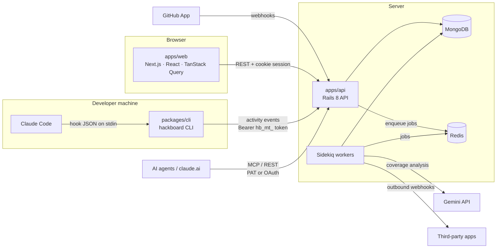

# HackBoard

**The open-source hackathon management platform.**

<!--
  Badges: each one requires registering the project first. Uncomment a badge only once
  the project exists on that platform, so the README never shows a broken badge.

  REUSE: the repository already passes `reuse lint` (checked in CI); register it at
  https://api.reuse.software/register to enable the badge.
  [](https://api.reuse.software/info/github.com/igarbayo/hackathon-management)

  OpenSSF Best Practices: sign in at https://www.bestpractices.dev/ with GitHub, add the
  project and replace <PROJECT_ID> with the number it is given.
  [](https://www.bestpractices.dev/projects/<PROJECT_ID>)

  OpenSSF Scorecard: add the Scorecard GitHub Action (https://github.com/ossf/scorecard-action)
  with `publish_results: true`; the badge works after its first run.
  [](https://scorecard.dev/viewer/?uri=github.com/igarbayo/hackathon-management)
-->

[](LICENSE)

HackBoard helps a hackathon team of 2 to 6 people keep track of:

- **the challenge:** its objectives, and which features cover them;
- **who is working on what:** a kanban board fed by real activity;
- **how much time is left:** milestones and deadlines.

Updating a board by hand is the first thing a team stops doing under pressure.
HackBoard instead **works out the state of the project from real activity**: commits and
pull requests on GitHub, and Claude Code sessions. An AI analysis (Gemini) then compares
what the team is building with what the challenge asks for.

The functional specification lives in [`specs/`](specs/README.md) and is the source of
truth for the project (it is written in Spanish). Read it before changing code.

## Contents

- [Features](#features)
- [Architecture](#architecture)
- [Quickstart (local development)](#quickstart-local-development)
- [Usage examples](#usage-examples)
- [Configuration](#configuration)
- [Supported platforms](#supported-platforms)
- [Production](#production)
- [Tests](#tests)
- [Troubleshooting](#troubleshooting)
- [Support](#support)
- [License](#license)

## Features

- **Teams with a join code.** The team owner creates the team and shares a code such as
  `K7Q2-M9XA`, which teammates use to join.
- **Objectives and features.** Features live on a kanban board with drag and drop, and
  each feature is linked to the challenge objectives it covers.
- **Pros and cons with votes.** Use them to settle design decisions quickly.
- **Milestones and a timeline.** Every screen shows how much time is left.
- **Activity feed** from a GitHub App (commits, PRs) and from Claude Code (through the
  `hackboard` CLI hooks). Activity is attributed to features in three layers:
  - deterministic rules;
  - AI suggestions;
  - human confirmation.
- **AI coverage analysis** with Gemini. It builds an *objectives × features* matrix and
  reports what is missing, what is surplus, and alerts. Each person uses their own Gemini
  API key, which is encrypted at rest.
- **Programmatic access:**
  - a REST API with personal access tokens and scopes;
  - an MCP server with read and write tools;
  - OAuth 2.1, so claude.ai can use HackBoard as a custom connector;
  - integration tokens and outbound webhooks.
- **Privacy by default.** Connecting Claude Code is opt-in for each person. HackBoard never
  stores diffs, file contents or prompt text.

## Architecture



| Path | What it is |
|---|---|
| `apps/web` | Next.js (App Router), Tailwind, shadcn/ui on Base UI, Lucide, TanStack Query and dnd-kit |
| `apps/api` | Rails 8 in `--api` mode, Mongoid, Sidekiq and Redis |
| `packages/cli` | `hackboard` CLI: installs the Claude Code hooks and sends activity events |
| `packages/shared-schemas` | JSON Schemas shared by the API and the CLI (ingestion events, AI output) |
| `specs/` | Functional specification, ADRs and the spec changelog |

Data flow, using a commit as the example:

1. You push to GitHub.
2. The GitHub App sends a webhook to `apps/api`.
3. A Sidekiq job stores an `ActivityEvent` and tries to attribute it to a feature.
4. The feed and the kanban board in `apps/web` show the new activity.

## Quickstart (local development)

Requires Docker.

```sh
cp apps/api/.env.example apps/api/.env
cp apps/web/.env.example apps/web/.env.local
docker compose up
```

- `web`: http://localhost:3000
- `api`: http://localhost:3001

Open http://localhost:3000, sign up with email and password, and create a team. Login
with GitHub or Google only works once their client IDs are set up (see
[Configuration](#configuration)).

## Usage examples

### Connect Claude Code to your team

Install the CLI globally, because each hook runs the binary and `npx` is too slow for
hooks. The package is not published to npm yet, so build it from this repository:

```sh
npm install
npm run build --workspace packages/shared-schemas --workspace packages/cli
npm install -g ./packages/cli
```

Then, from the repository your team is working on:

```sh
hackboard init --team K7Q2-M9XA   # log in in the browser, choose a privacy level, install hooks
hackboard status                  # team, privacy level, queued events, last successful send
hackboard test                    # send a test event; it appears under /activity
```

Change your privacy level, pause sending, or remove everything:

```sh
hackboard privacy metadata        # metadata | summaries | off
hackboard pause                   # or: hackboard resume
hackboard uninstall --purge       # remove hooks and token, and delete your events on the server
```

### Let an AI agent read and update the board over MCP

Create a personal access token in **Equipo y ajustes → API y MCP** (the web UI is in Spanish), then:

```sh
claude mcp add --transport http hackboard http://localhost:3001/api/v1/mcp \
  --header "Authorization: Bearer hb_pat_…"
```

The agent can now list features, move them on the board and report progress, within the
scopes you gave the token.

### Call the REST API

```sh
curl http://localhost:3001/api/v1/teams/<team_id>/features?status=in_progress \
  -H "Authorization: Bearer hb_pat_…"
```

The API describes itself at `GET /api/v1/openapi.json`.

## Configuration

Configuration uses environment variables. `apps/api/.env.example` and
`apps/web/.env.example` list all of them. The main ones:

| Variable | App | Purpose |
|---|---|---|
| `MONGODB_URI`, `REDIS_URL` | api | Database and job queue |
| `APP_URL`, `API_URL` | api | Public URLs of the web and the API |
| `SESSION_SECRET` | api | Signs session cookies. Change it outside development. |
| `GITHUB_APP_ID`, `GITHUB_APP_SLUG`, `GITHUB_APP_PRIVATE_KEY`, `GITHUB_WEBHOOK_SECRET`, `GITHUB_CLIENT_ID`, `GITHUB_CLIENT_SECRET` | api | GitHub App (activity feed and GitHub login) |
| `GOOGLE_CLIENT_ID`, `GOOGLE_CLIENT_SECRET` | api | Google login (OpenID Connect) |
| `GEMINI_MODEL`, `AI_PROVIDER` | api | AI model. The API key is not a server variable: each person adds theirs in their profile. |
| `GEMINI_API_KEY_ENCRYPTION_KEY`, `WEBHOOK_SECRETS_KEY` | api | Encrypt secrets at rest |
| `GEMINI_API_KEY` | api (dev only) | Used only by `rake ai:eval` to evaluate the prompt locally |
| `NEXT_PUBLIC_API_URL` | web | URL of the API |
| `NEXT_PUBLIC_SITE_URL` | web | Public URL of the web (canonical URLs, sitemap, Open Graph) |

See [`specs/01-arquitectura.md`](specs/01-arquitectura.md) for the full list.

## Supported platforms

| Component | Supported | Tested in CI |
|---|---|---|
| Server (api, worker) | Linux containers, Ruby 3.3 | `ubuntu-latest`, through Docker Compose |
| Web | Node.js 20, Next.js 16 | `ubuntu-latest` |
| Browser | Current Chromium, Firefox and Safari | Chromium (Playwright end-to-end tests) |
| `hackboard` CLI | Node.js ≥ 20 on Linux, macOS and Windows | `ubuntu-latest` (Vitest) |
| MongoDB | 7.x | `mongo:7` |
| Redis | 7.x | `redis:7` |

## Production

To rebuild the production server with the latest changes:

```sh
git pull
docker compose -f docker-compose.prod.yml build
docker compose -f docker-compose.prod.yml up -d --force-recreate
```

`docker-compose.prod.yml` runs only `api` and `worker`. MongoDB and Redis are external
services, configured through `apps/api/.env.production`.

## Tests

```sh
# api (Rails + Mongoid)
docker compose run --rm -e RAILS_ENV=test -e MONGODB_URI=mongodb://mongo:27017/hackboard_test -e REDIS_URL=redis://redis:6379/1 api bundle exec rspec

# web, cli, shared-schemas
npm test --workspaces
```

CI (`.github/workflows/ci.yml`) also runs RuboCop, Brakeman, bundler-audit, ESLint, the
TypeScript build and `npm audit` on every push.

## Troubleshooting

| Symptom | Cause and fix |
|---|---|
| `docker compose up` fails with "port is already allocated" | Something else is using port 3000, 3001, 27017 or 6379. Stop it, or change the host port in `docker-compose.yml`. |
| The API fails at boot with `ArgumentError: wrong number of arguments` inside `JSON.parse` | The `json` gem version does not match the one built into the Ruby image. Keep the `json` version pinned in `apps/api/Gemfile` and rebuild with `docker compose build api`. |
| GitHub App requests fail with an invalid private key | `GITHUB_APP_PRIVATE_KEY` can be the multi-line PEM or a single line with `\n` escapes. Check that the value is not truncated and that it has no surrounding quotes. |
| "Analizar ahora" (Analyze now) returns `422 missing_gemini_api_key` | Add your Gemini API key in **Equipo y ajustes → IA (Gemini)**. Scheduled analyses use the team owner's key. |
| No Claude Code events show up in the feed | Hooks never fail loudly, by design: they always exit 0 with no output. Run `hackboard status` to see whether sending is paused, how many events are queued and when the last successful send was, and `hackboard test` to send a test event. |
| GitHub or Google login redirects to an error | The client ID or secret is missing, or the callback URL registered with the provider does not match `API_URL`. |

## Support

- **Bugs and feature requests:** open an issue at
  https://github.com/igarbayo/hackathon-management/issues.
- **Maintainer:** Ignacio Garbayo ([@igarbayo](https://github.com/igarbayo)).

## License

Copyright (C) 2026 Ignacio Garbayo.

HackBoard is free software: you can redistribute it and/or modify it under the terms of
the **GNU Affero General Public License** as published by the Free Software Foundation,
either version 3 of the License, or (at your option) any later version. It is distributed
**without any warranty**. See [`LICENSE`](LICENSE) for the full text.

If you run a modified version of HackBoard as a network service, the AGPL requires you to
offer its source code to your users.

The HackBoard **logos and icons** are an exception: they are all rights reserved and not
covered by the AGPL (see [`LICENSES/LicenseRef-AllRightsReserved.txt`](LICENSES/LicenseRef-AllRightsReserved.txt)).
A fork must replace them with its own artwork. Code adapted from other projects keeps its
original MIT notice in an SPDX header. Every file's copyright and license are declared
following [REUSE](https://reuse.software/) (see [`REUSE.toml`](REUSE.toml)).

For the reasons behind this license and the licenses
of every dependency, see
[`docs/COMPONENTS_LICENSE.md`](docs/COMPONENTS_LICENSE.md).
